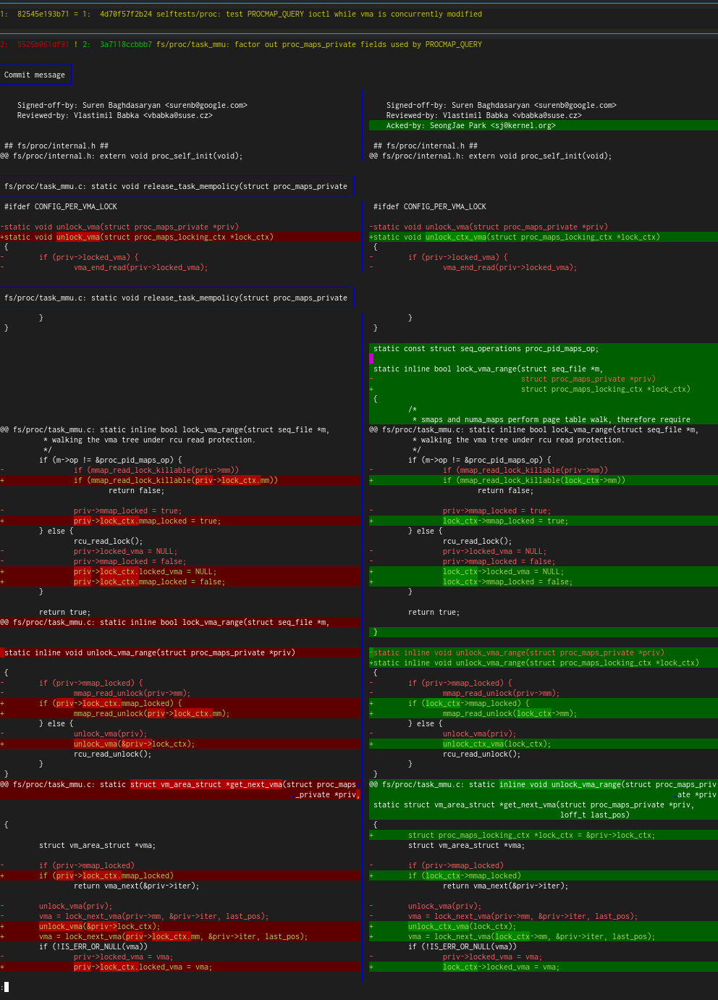
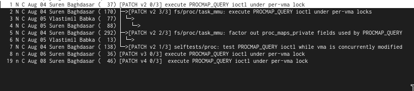

# review-scripts

A series of scripts to help reviewing of kernel patch series. These are
essentially light wrappers around other tooling to make review faster.

**DISCLAIMER:** I don't guarantee these won't lose you work, destroy your git repos,
            cause lego to fall beneath your bare foot such that you step on it
            or any other such calamities and I disclaim all responsibility for
            such! Use these at your own risk.

Note this will generate ugly local tags to store metadata of the form
review-xxx. Using `review-stop` or `review-clean` will clean these up.

It will also create branches of the form `review/[name]-[version]`. Use
`review-clean` to get rid of these.

## Dependencies

* usual coreutils etc.
* git (>= v2.45)
* b4
* git-delta
* virtme-ng
* neomutt
* ansi2txt
* delta

## Installation

1. Ensure dependencies are installed.
2. Put this directory on your `$PATH`.

It is recommended that you run:

```
git config --global am.threeWay true
```

So that you can resolve conflicts in series when they are applied.

### Hooks

Kernel configuration and build scripts are located in the `hooks/` subdirectory:

* `kernel-config` - run once before build.
* `kernel-build` - run for each build.

## Scripts

**IMPORTANT**: b4 isn't always great at finding all the versions of a
series. Therefore you may need to have separate review names for separate
revisions. You can use `review-diff-pair` to workaround this issue for range
diff comparisons.

* `review-start [name] [head] [msgid]` - Start a review which you're naming
  `name`, which you're basing on revision `head` and where `msgid` is the msgid
  that exists in lore for a message in one of the revisions you intend to
  review. Runs `review-get` on startup to setup review branches.

* `review-start-applied [name] [base ref] [head ref] [msgid] [version]` -
  Manually start a review where the series has already been applied and exists
  in the tree, from `base ref` to `head ref` at version `version`. From there
  you can use the rest of the review tools as if it were obtained normally.

* `review-get [name]` - Retrieves latest messages for all revisions and updates
  local branches, placing them in `review/name-vN` braanches.

* `review-stop [name]` - Remove tag for review but leave branches around.

* `review-clear [name]` - Clear everything (tag and branches) for the specified
  review.

* `review-clear-branches [name]` - Just clear the branches, leave the review
  active.

* `review-diff [name]` - Provide a side-by-side range-diff between the latest
  revision in the series and the prior one.

* `review-diff-pair [previous name] [current name] <previous version> <current
  version>` - Same as review-diff, except it's comparing ranges across separate
  reviews. Useful for series that b4 loses track of, or RFC -> non-RFC, etc.

* `review-diff-each [name] <version>` - Review each individual patch in the
  series at the specified version (or latest if not specified) using `git show`.

* `review-read [name]` - Retrieve the mail for all versions of the series and
  all replies, and load it in neomutt.

* `review-checkpatch [name] <version>` - Just run `checkpatch.pl` against all
  patches in series.

* `review-check [name] <version>` - Build each patch. Defaults to the latest
  version, unless specified. Afterwards this runs `checkpatch.pl` against each
  patch.

* `review-check-mm-tests [name] <version>` - Build series at specified version
  or if not specified, the latest, compile the mm self tests and then run them
  in this kernel version. **WARNING:** this runs with sudo and R/W with access
  to host file system. Some tests won't work if you don't do this, so don't
  blame me if your filesystem breaks.

* `review-check-mm [name] <version>` - Execute _all_ checks for mm series, from
  easiest checks to hardest, so a checkpatch check first, then self tests check,
  then individual per-patch build test.

* `review-mm-tests <--vma-tests-only> <--mm-tests-only>` - Build/run VMA tests
  and/or memory management self tests, but _no review has to be active_, this
  will simply be run against the current kernel tree for convenience.

* `review-mbox [name]` - Retrieves an mbox of all mails associated with series,
  and saves it into the local directory as `review_[name].mbx`.

* `review-patches [name] <version>` - Retrieves all the patches in the series
  and saves them locally as a series of *.patch files (minus the cover patch),
  optionally at the specified version, if not specified then the latest.

* `review-build` - Simple script to configure and build the kernel using the
  configuration/build hooks.

* `review-rebuild` - Same as `review-build` but runs `review-reconfig` first,
  resetting the config and rebuilding the kernel from scratch.

* `review-rebuild-debug` - Same as `review-rebuild` but uses
  `review-reconfig-debug` to build a kernel with extra debug checks.

* `review-config` - Simple script to configure the kernel using the
  configuration hook.

* `review-config-debug` Same as `review-config`, but sets additional debug
  options that might slow things down quite a bit.

* `review-reconfig` - Same as `review-config` only run a `make mrproper` first to
  clear existing configuration.

* `review-reconfig-debug` - Same as `review-config-debug` only run a `make
  mrproper` first to clear existing configuration.

* `review-rebase [name] [new_base] <version>` - Rebase the review branch on to
  new_base, either at the specified version, or if not specified the latest. See
  `review-rebase-branch` for further details.

* `review-rebase-branch [branch] [old_base] [new_base] <nopause>` - Rebase
  `branch` from `old_base` to `new_base`. This assumes you're dealing with an
  often-rebased repo (which kernel development repos/branches often are), so
  tries to do this with a cherry-pick. Since conflicts can arise, we have 2 ways
  of dealing with it - manually, where an error message indicates user can
  manually give up on it (see `review-rebase-abort`) or continue applying steps
  after cherry-pick resolutions applied (see
  `review-rebase-continue`). Alternatively, if able to (`nopause` param is
  unset), the script will pause and allow resolution in the background, and can
  be resumed via `fg`.

* `review-rebase-abort [branch] [old_base] [new_base]` - Aborts an ongoing
  cherry-pick rebase started by `review-rebase` or `review-rebase-branch` -
  cleaning up the mess created.

* `review-rebase-continue [branch] [old_base] [new_base]` - Continues an ongoing
  cherry-pick rebase started by `review-rebase` or `review-rebase-branch` -
  performing the final steps to apply the rebase.

* `review-vng [args...]` - Execute virtme-ng with sensible configuration options
  for development - verbose output for dmesg logs, panic-on-warning,oops and a
  configuration that is known-working with mm selftests.

* `review-vng-debug [args...]` - Same as `review-vng` but with more noise useful
  for debugging.

## Credit

Thanks to [Tomáš Janoušek](https://genserver.social/users/liskin) for his
incredible
[article](https://work.lisk.in/2023/10/19/side-by-side-git-range-diff.html) on
implementing the side-by-side diff for git range-diff.

I include his `git-range-diff-delta-preproc` helper script under the MIT license.

## Example

## Start review, fixup conflict, grab again

```
# Start review, grab series
]$ review-start procmap_query mm-unstable 20250804231552.1217132-1-surenb@google.com
--- retrieving data for [procmap_query]... ---
Grabbing thread from lore.kernel.org/all/20250804231552.1217132-1-surenb@google.com/t.mbox.gz
...
Applying: selftests/proc: test PROCMAP_QUERY ioctl while vma is concurrently modified
Applying: fs/proc/task_mmu: factor out proc_maps_private fields used by PROCMAP_QUERY
Using index info to reconstruct a base tree...
M	fs/proc/internal.h
M	fs/proc/task_mmu.c
Falling back to patching base and 3-way merge...
Auto-merging fs/proc/internal.h
Auto-merging fs/proc/task_mmu.c
CONFLICT (content): Merge conflict in fs/proc/task_mmu.c
Patch failed at 0002 fs/proc/task_mmu: factor out proc_maps_private fields used by PROCMAP_QUERY
error: Failed to merge in the changes.
hint: Use 'git am --show-current-patch=diff' to see the failed patch
hint: When you have resolved this problem, run "git am --continue".
hint: If you prefer to skip this patch, run "git am --skip" instead.
hint: To restore the original branch and stop patching, run "git am --abort".
hint: Disable this message with "git config set advice.mergeConflict false"

WARNING: shazam failed, if due to conflict, please resolve and re-run command.
$ # fix conflict
$ git am --continue
$ review-get
...
Unable to find revision 1
b4 cannot find version 1, deleting branch 'review/procmap_query-v1'
Deleted branch review/procmap_query-v1 (was c617a4dd7102).
$ git branch | grep review
  review/procmap_query-v2
  review/procmap_query-v3
* review/procmap_query-v4
```

Now all versions of the series, apart from the one b4 can't find (v1) are in
branches.

```
$ review-diff procmap_query
```



Now I can check that all patches in the latest revision pass checkpatch.pl:

```
$ review-checkpatch procmap_query
--- retrieving data for [procmap_query]... ---
Grabbing thread from lore.kernel.org/all/20250804231552.1217132-1-surenb@google.com/t.mbox.gz
Checking for newer revisions
Grabbing search results from lore.kernel.org
  Added from v3: 4 patches
  Added from v4: 4 patches
23 messages in the thread
Saved /tmp/tmp.DNbDXaXVd5/review-procmap_query.mbx
--- ...retrieving data for [procmap_query] ---
Analyzing 23 messages in the thread
Looking for additional code-review trailers on lore.kernel.org
Analyzing 9 code-review messages
Checking attestation on all messages, may take a moment...
---
  [PATCH v4 1/3] selftests/proc: test PROCMAP_QUERY ioctl while vma is concurrently modified
    ● checkpatch.pl: passed all checks
  [PATCH v4 2/3] fs/proc/task_mmu: factor out proc_maps_private fields used by PROCMAP_QUERY
    ● checkpatch.pl: passed all checks
  [PATCH v4 3/3] fs/proc/task_mmu: execute PROCMAP_QUERY ioctl under per-vma locks
    + Reviewed-by: Vlastimil Babka <vbabka@suse.cz>
    ● checkpatch.pl: passed all checks
  ---
  NOTE: install dkimpy for DKIM signature verification
---
Total patches: 3
---
Cover: ./v4_20250808_surenb_execute_procmap_query_ioctl_under_per_vma_lock.cover
 Link: https://lore.kernel.org/r/20250808152850.2580887-1-surenb@google.com
 Base: using specified base-commit c2144e09b922d422346a44d72b674bf61dbd84c0
       git checkout -b v4_20250808_surenb_google_com c2144e09b922d422346a44d72b674bf61dbd84c0
       git am ./v4_20250808_surenb_execute_procmap_query_ioctl_under_per_vma_lock.mbx
```

Build test every commit in latest revision:

```
$ review-check procmap_query
<kernel build automatically performed for every commit in series>
```

Read all mails in the thread:

```
$ review-read procmap_query
```



Run all the mm self-tests at the latest version:

```
$ review-check-mm-tests
< test results >
```
